# 🚀 **Inventory Management App – Flask**

Modern, clean, and fully responsive Inventory Management System built with **Flask**, **Tailwind**, and **SQLite**.
Designed for smooth item handling, user profiles, authentication, and real-time search.

<p align="center">
  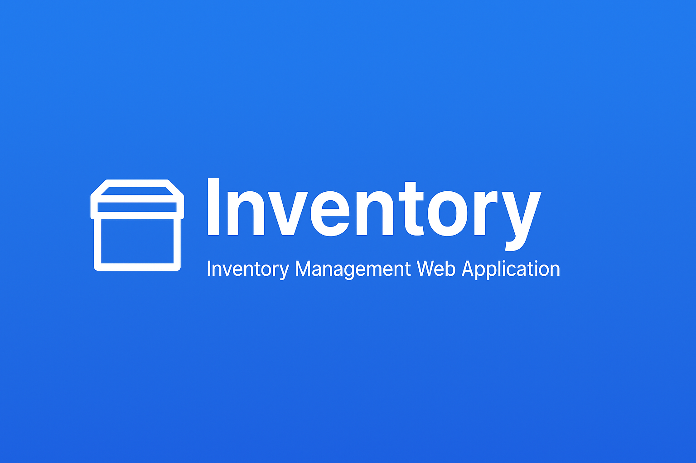
</p>

---

## 📛 **Badges**

<p align="left">
  
  
  
  
  
</p>

---

# ⭐ **Features**

✔️ User Registration & Login
✔️ Profile Page + Bio + Avatar
✔️ Add, Edit, Delete Items
✔️ Real-Time Search
✔️ Modern Dashboard with Analytics
✔️ Clean UI/UX with Tailwind
✔️ Flash Messages for Feedback
✔️ Secure Password Hashing

---

# 📂 **Project Structure**

```
inventory_flask/
│── app.py
│── api.py
│── auth.py
│── config.py
│── dashboard.py
│── extensions.py
│── forms.py
│── inventory.db
│── LICENSE
│── main.py
│── models.py
│── profile.py
│── README.md
│── requirements.txt
│
├── assets/
│ └── banner.png
│
├── screenshots/
│ ├── add_item_1.png
│ ├── add_item_2.png
│ ├── change_password_1.png
│ ├── change_password_2.png
│ ├── dashboard_1.png
│ ├── dashboard_2.png
│ ├── edit_profile_1.png
│ ├── edit_profile_2.png
│ ├── home.png
│ ├── login.png
│ ├── profile.png
│ ├── register.png
│ ├── search.png
│ └── view.png
│
├── static/
│ ├── avatars/
│ ├── css/
│ └── uploads/
│
├── templates/
│ ├── 404.html
│ ├── 500.html
│ ├── add.html
│ ├── base.html
│ ├── change_password.html
│ ├── dashboard.html
│ ├── edit.html
│ ├── import_csv.html
│ ├── index.html
│ ├── login.html
│ ├── profile_edit.html
│ ├── profile.html
│ ├── register.html
│ ├── search.html
│ ├── view.html
│ └── ...
│
└── tests/
├── conftest.py
├── test_auth.py
├── test_models.py
└── test_routes.py
```

---

# 🛠️ **Tech Stack**

### **Backend**

* Flask
* Flask-Login
* Flask-WTF

### **Frontend**

* TailwindCSS
* Flowbite UI Components

### **Database**

* SQLite (default)
* SQLAlchemy ORM

---

# 🔧 **Installation Guide**

### **1️⃣ Clone Repo**

```bash
git clone https://github.com/Rumaisas-islam/inventory-management-flask.git
cd inventory_flask
```

### **2️⃣ Create Virtual Environment**

```bash
python -m venv venv
```

### **3️⃣ Activate (Windows)**

```bash
venv\Scripts\activate
```

### **4️⃣ Install Dependencies**

```bash
pip install -r requirements.txt
```

### **5️⃣ Run App**

```bash
flask run
```

---

# 📸 **Screenshots**

## 🏡 **Homepage**

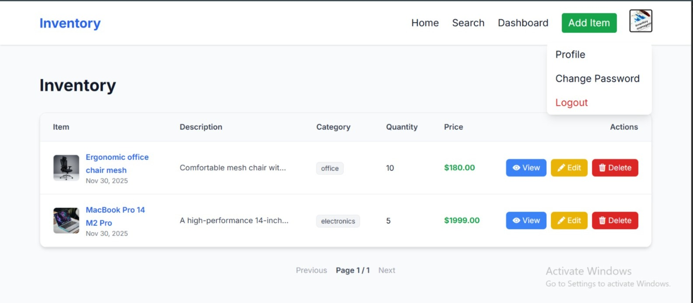

---

## 📊 **Dashboard**

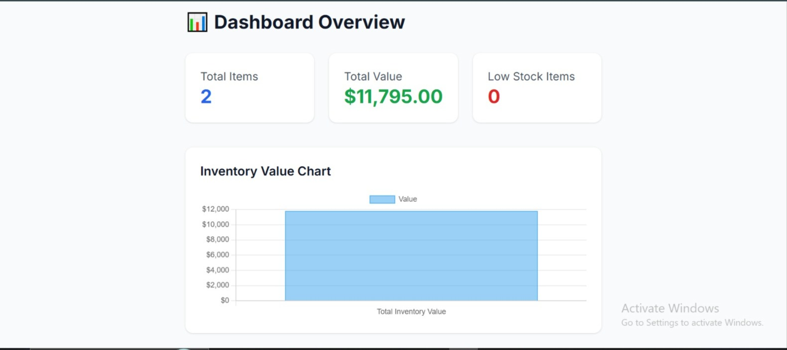
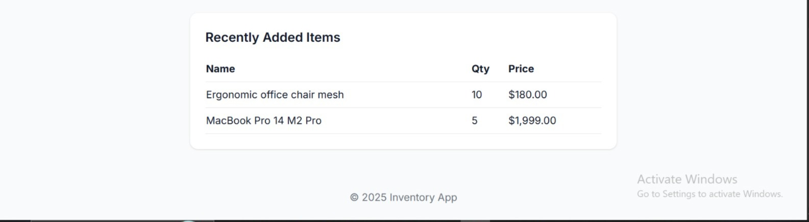

---

## ➕ **Add Item**

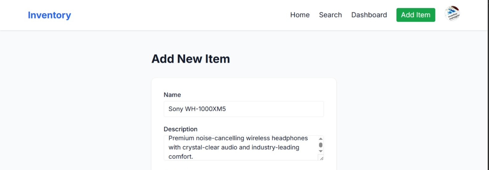
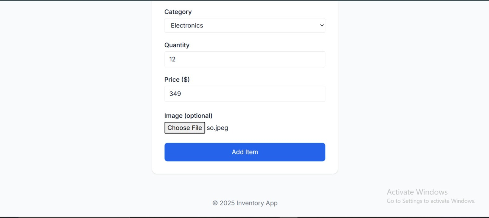

---

## 🔍 **Search Page**

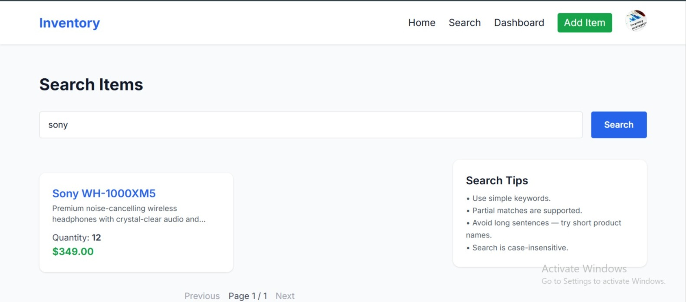

---

## 👤 **Profile Page**

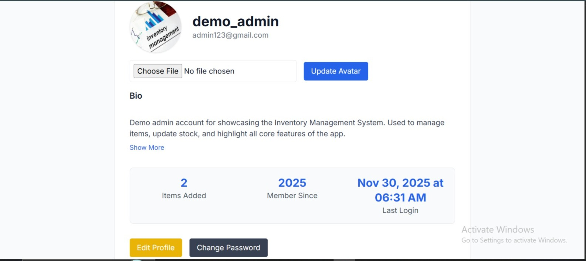

---

## ✏️ **Edit Profile**

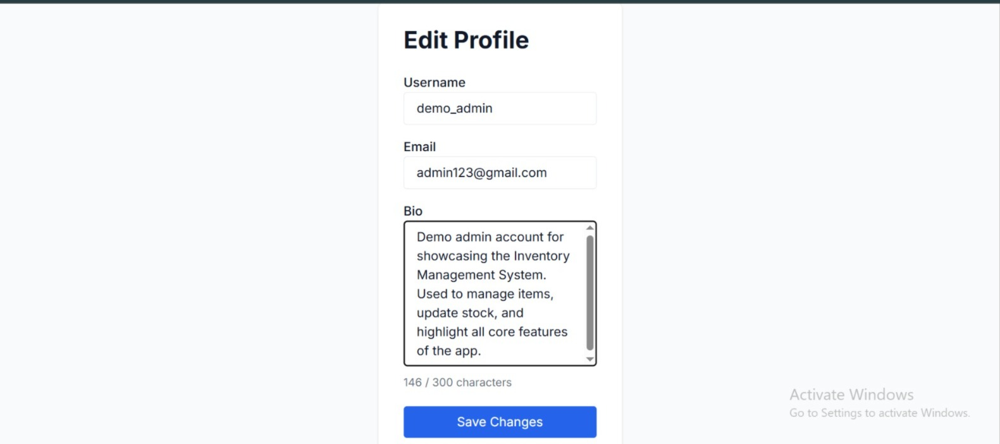
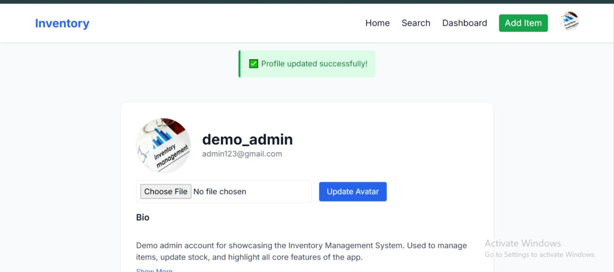

---

## 🔐 **Change Password**

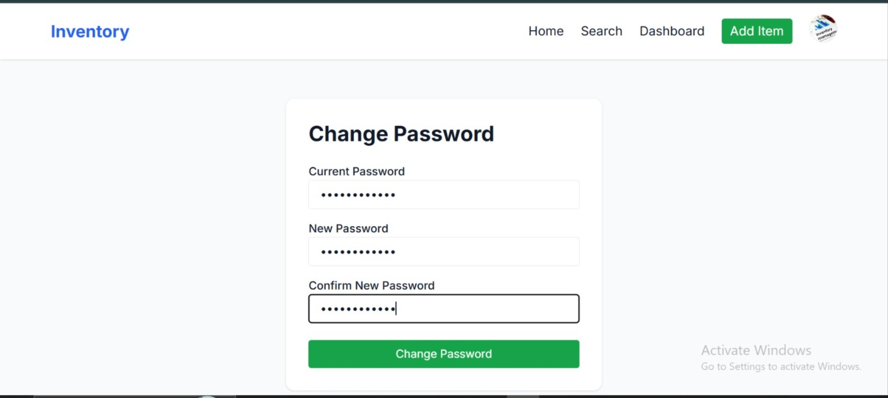
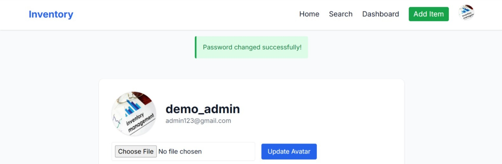

---

## 🔑 **Login**

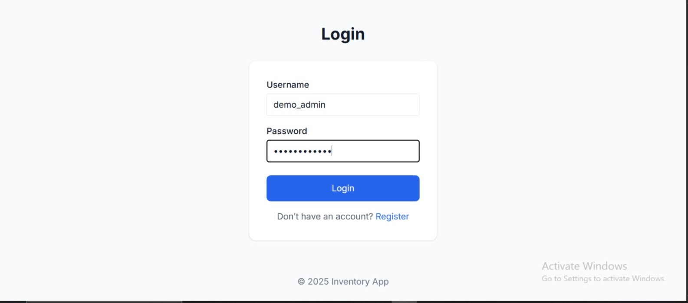

---

## 📝 **Register**

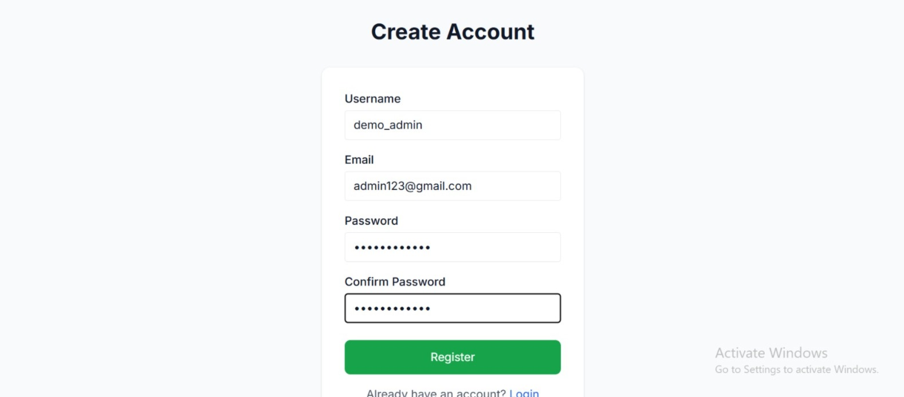

---

# 📄 **License**

This project is open-source and available under the **MIT License**.

---

# 🙌 **Author**

**Rumaisas-islam**
Made with ❤️ in Pakistan
If you like this project, ⭐ the repo!
